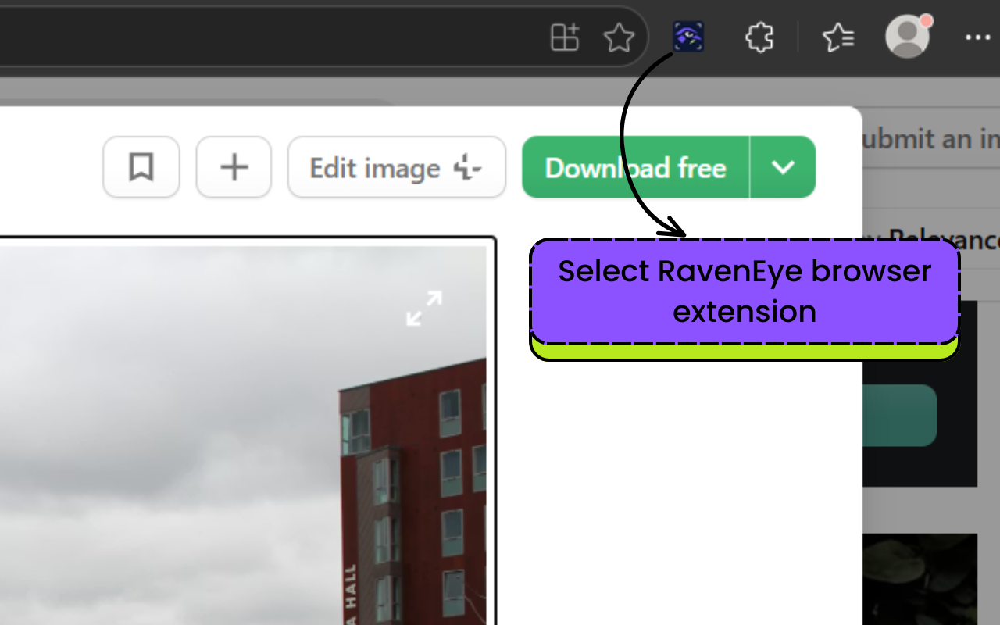
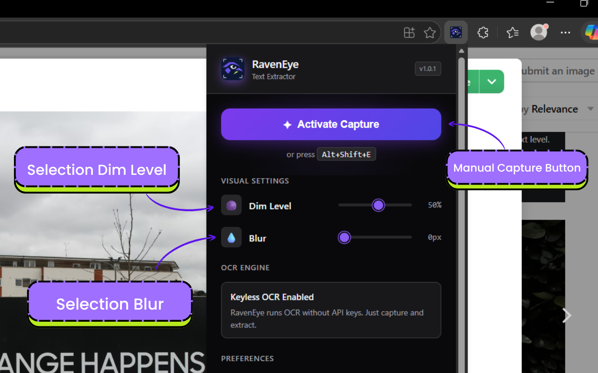
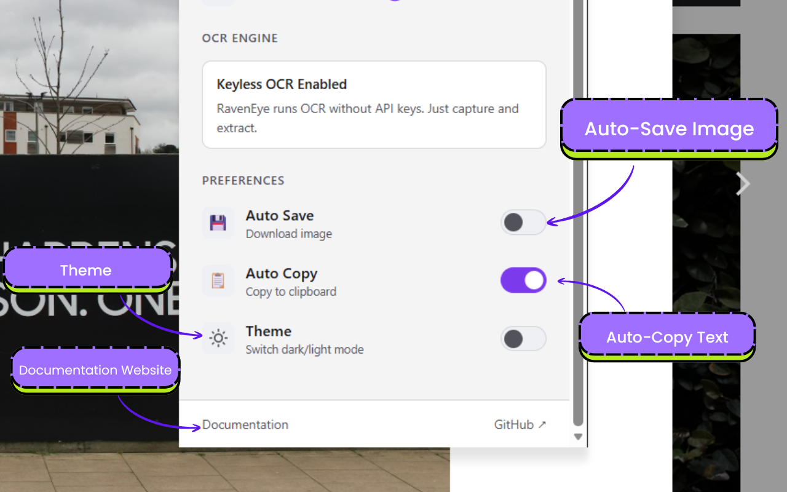
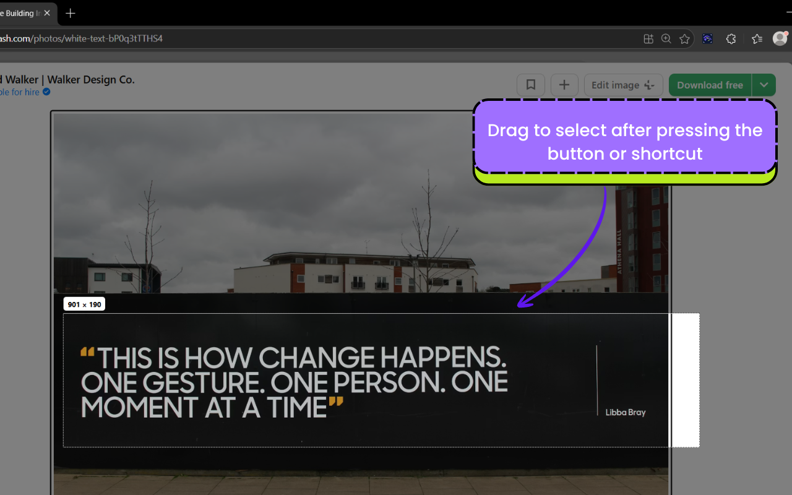
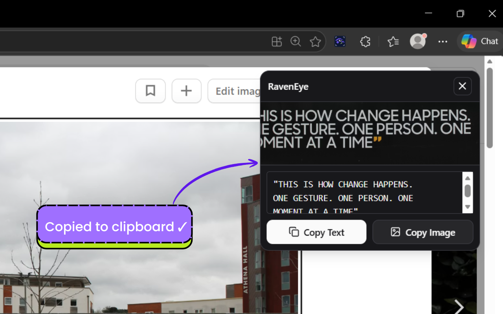

# RavenEye

RavenEye is a browser extension that captures any on-screen region and extracts text using OCR across supported browsers.

[](https://github.com/devadarshmay-eng/RavenEye/releases)
[](https://github.com/devadarshmay-eng/RavenEye/blob/main/LICENSE)
[](https://github.com/devadarshmay-eng/RavenEye)
[](https://github.com/devadarshmay-eng/RavenEye)

**Documentation:** https://devadarshmay-eng.github.io/RavenEye/  
**Privacy Policy:** https://devadarshmay-eng.github.io/RavenEye/privacy-policy.html

### Get RavenEye

[](https://microsoftedge.microsoft.com/addons/detail/raveneye/koocdabapmgclncoapkboamlpblhnaaj?hl=en-US)
[](https://addons.mozilla.org/en-US/firefox/addon/raveneye/)

Install RavenEye directly from the Firefox Add-ons listing.

## Project Overview

RavenEye is designed for fast text capture from web pages, PDFs, videos, and visual content where direct copy is not available. It provides a lightweight capture flow and immediately returns extracted text for copying and reuse.

## OCR Relay Setup (required)

The **v1.0.3 API release** requires an OCR relay endpoint. It sends the selected image to the URL you configure; no provider secret is shipped in the extension.

RavenEye now uses a configurable OCR relay endpoint so provider secrets stay on the server side.

1. Deploy or use an OCR relay endpoint that accepts `POST` JSON:
   - `imageDataUrl` (data URL string)
   - `language` (optional, currently `eng`)
2. Return JSON with extracted text in one of:
   - `text`
   - `ocrText`
   - `extractedText`
   - `data.text` / `result.text`
3. In extension popup settings, set **OCR Relay URL** (e.g. `https://your-domain.com/api/ocr`).

## Feature Highlights

- Keyboard shortcut and popup-based capture activation
- Region selection with configurable dim and blur overlay
- OCR extraction with automatic clipboard copy support
- Optional capture image download
- Theme-aware popup settings interface
- Documentation and privacy pages published via GitHub Pages

## Offline browser releases

The offline release includes separate bundles for Chromium-based browsers and Firefox. Both bundles run English OCR locally with Tesseract.js and a bundled WASM engine/model, so they require no API endpoint or internet connection after installation. The capture is upscaled and contrast-adjusted before OCR to improve recognition of small text.

Build both offline bundles and their checksums with:

```bash
npm run build:offline
npm run release:package:offline
```

Use the Chromium bundle for Chrome, Edge, Brave, and other Chromium browsers, and the Firefox bundle for Firefox.

## Installation

### Local development (unpacked extension)

```bash
git clone https://github.com/devadarshmay-eng/RavenEye.git
cd RavenEye
npm install
```

1. Open your browser's extension management page (for example, `chrome://extensions/`, `edge://extensions/`, `brave://extensions/`, or `about:addons`).
2. Enable **Developer mode**.
3. Select **Load unpacked**.
4. Choose the `public/` folder.

### Build the marketplace bundle

```bash
npm run lint
npm run build
npm run release:validate
npm run release:package
```

Zip the **contents** of `dist-extension/` (not the parent folder).  
Use that ZIP for extension marketplace uploads.

## Edge Add-ons release automation

### One-time onboarding

1. Run the onboarding helper:

```bash
npm run edge:onboarding
```

2. In Partner Center, create your extension product and Publish API credentials.
3. Add GitHub secrets:
   - `EDGE_PRODUCT_ID`
   - `EDGE_CLIENT_ID`
   - `EDGE_API_KEY`

### Automated release pipeline

- Automatic path:
  - Push the API release tag `v1.0.3` to `main`.
  - Pipeline auto-builds, creates GitHub release, uploads package, and submits publish request to Edge.
- Manual path:
  - Trigger **Edge Release Pipeline** via `workflow_dispatch`.
  - Choose:
    - `publish = false` to upload draft only.
    - `publish = true` to upload and publish immediately.
- The workflow runs:
  1. lint/build/preflight validation
  2. package + checksum generation
  3. GitHub release asset creation
  4. Edge Add-ons API upload/publish
  5. listing media artifact generation

> Note: end-user updates are automatic after Microsoft approves each submitted update.

## Docs/Privacy site troubleshooting (404)

If `https://devadarshmay-eng.github.io/RavenEye/` or `/privacy-policy.html` returns 404:

1. Open repository **Settings > Pages**.
2. Under **Build and deployment**, set **Source** to **GitHub Actions**.
3. Rerun workflow **Deploy RavenEye Docs**.
4. Wait for deploy job completion, then recheck:
   - `https://devadarshmay-eng.github.io/RavenEye/`
   - `https://devadarshmay-eng.github.io/RavenEye/raveneye-docs.html`
   - `https://devadarshmay-eng.github.io/RavenEye/privacy-policy.html`

## Usage

1. Activate capture from the popup button or by pressing `Alt+Shift+E`.
2. Drag to select the target screen region.
3. Wait for OCR extraction to complete.
4. Copy text from the result view or save capture output, based on your settings.

## Screenshots

The screenshot set is ordered for release listings and product walkthrough:

1. **Problem [ not all texts cant be copied ]**  
   ![Problem [ not all texts cant be copied ]](assets/screenshots/01-capture-activation.png)
2. **selecting raveneye extension**  
   
3. **exntension pop up**  
   
4. **pop up / extension settings**  
   
5. **snip selecting the selection**  
   
6. **selected text**  
   

## Tech Stack

| Layer | Technology |
|---|---|
| Extension Platform | Chromium-based browsers and Firefox |
| OCR Endpoint | Configurable OCR relay or bundled local Tesseract.js |
| UI Runtime | React 18 + TypeScript + Vite |
| Storage | Browser-provided extension storage |
| Styling | Tailwind CSS + Radix UI |

## Roadmap

- Multi-language OCR improvements
- Capture history and retrieval
- Offline browser bundles
- OCR post-processing quality enhancements

## Contributing

1. Fork the repository and create a feature branch.
2. Keep changes scoped and production-safe.
3. Run `npm run lint` and `npm run build`.
4. Open a pull request with a clear summary and test notes.

## License

MIT — see [LICENSE](LICENSE).

